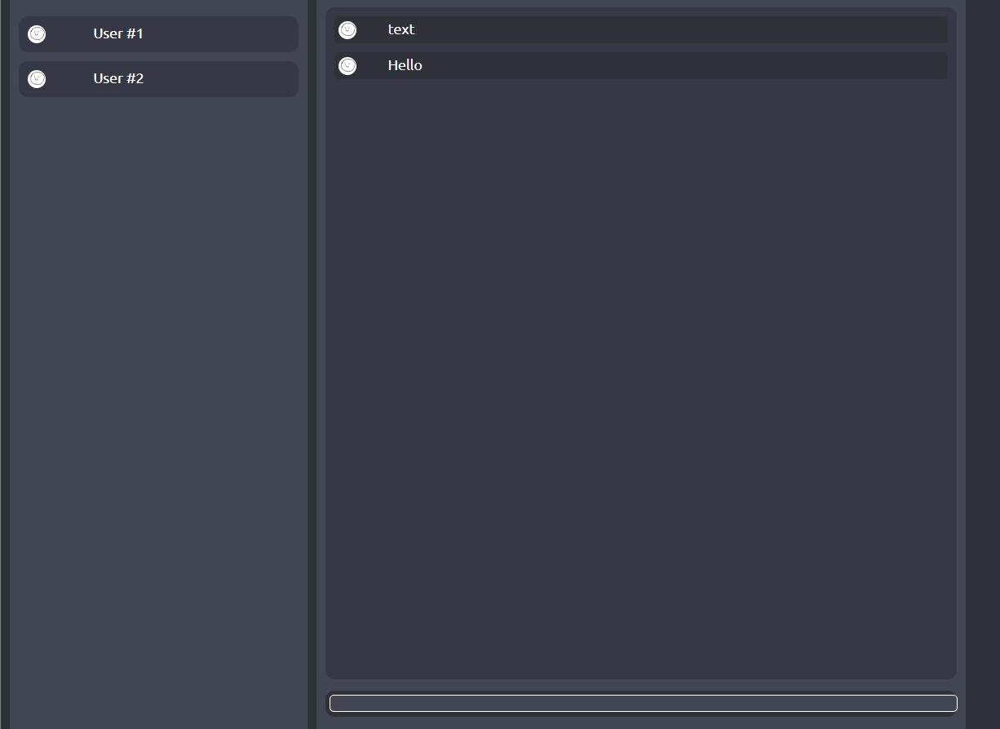

# ACCN Web Dev 2 Template

This template uses VANILLA js

## How to setup Python

run the setup.py in the `server` folder

## How to run the Website

the website is in `frontend` and is named `index.html`

`python setup.py install`
